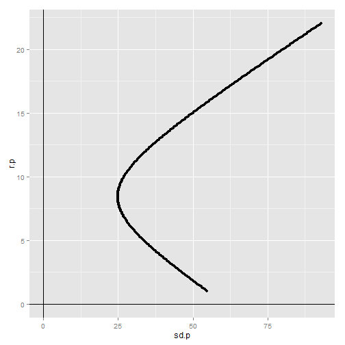
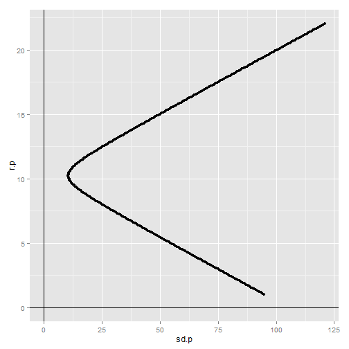

Portfolio allocation - two risky assets - large cap (rl) and small (rs) cap stocks

Weight (w) is weight in large cap (rl).  (1-w) is weight in small cap.


```r
library(ggplot2)

rl <- 8
rs <- 15
sd.l <- 25
sd.s <- 50
c <- 0.4
cv <- 0.4 * sd.l * sd.s


w <- seq(-1,2,0.01) # various weights
sd.p <- sqrt( w^2 * sd.l^2 + (1-w)^2 * sd.s^2 + 2 * w * (1-w) * c * sd.l * sd.s )

# NOTE - the return on portfolio (r.p) depends only on weights and asset returns.
# doesn't depend on volatility or correlation between assets
r.p <- w * rl + (1-w) * rs

qplot( x=sd.p, y=r.p ) + geom_vline(x=0) + geom_hline(y=0)
```

 

```r
min(sd.p)
```

```
## [1] 24.85257
```

```r
r.p[which.min(sd.p)]
```

```
## [1] 8.42
```

```r
w[which.min(sd.p)]
```

```
## [1] 0.94
```

### dominated when w=100% large 


```r
sd.p[which(round(sd.p,1) == sd.l)]
```

```
## [1] 25.01200 24.96422 24.95421 25.00000
```

```r
r.p[which(round(sd.p,1) == sd.l)]
```

```
## [1] 8.84 8.77 8.07 8.00
```

```r
w[which(round(sd.p,1) == sd.l)]
```

```
## [1] 0.88 0.89 0.99 1.00
```

### volatility at r.p=20% 


```r
r.p[which(round(r.p,1) == 20)]
```

```
## [1] 20.04 19.97
```

```r
sd.p[which(round(r.p,1) == 20)]
```

```
## [1] 80.50838 80.07005
```

NOTE: the return on portfolio (r.p) depends only on weights and asset returns.
It doesn't depend on volatility or correlation between assets.

## Change the correlation from 0.4 to -0.8.  

Changes the volatility.  No effect on r.p.


```r
c <- -0.8
sd.p <- sqrt( w^2 * sd.l^2 + (1-w)^2 * sd.s^2 + 2 * w * (1-w) * c * sd.l * sd.s )

qplot( x=sd.p, y=r.p ) + geom_vline(x=0) + geom_hline(y=0)
```

 

```r
min(sd.p)
```

```
## [1] 10.47855
```

```r
r.p[which.min(sd.p)]
```

```
## [1] 10.24
```

```r
w[which.min(sd.p)]
```

```
## [1] 0.68
```

### dominated when w=100% large 

```r
sd.p[which(round(sd.p) == sd.l)]
```

```
## [1] 25.3811 24.7308 25.0000
```

```r
r.p[which(round(sd.p) == sd.l)]
```

```
## [1] 12.48 12.41  8.00
```

```r
w[which(round(sd.p) == sd.l)]
```

```
## [1] 0.36 0.37 1.00
```

### volatility at r.p=20% 

```r
r.p[which(round(r.p,1) == 20)]
```

```
## [1] 20.04 19.97
```

```r
sd.p[which(round(r.p,1) == 20)]
```

```
## [1] 100.9792 100.2672
```


### Questions

**Question 1**: After changing the correlation from 0.4 to -0.8, does the minimum portfolio variance increase or decrease?   
Answer: decreases, from 24.9 to 10.5

**Question 2**: Is 100% in r.l a dominated position?   
Answer: When c=0.4, YES, because r.p (8.42) at min sd.p (24.9) is greater than r.l (8), while weight in r.l is less than 1 (0.94).  In other words,
there are portfolios that return more than r.l with less volatility.   

Answer: When c=-0.8, YES, because r.p (10.24) at min sd.p (10.5) is greater than r.l (8), while weight in r.l is less than 1 (0.68).  In other words,
there are portfolios that return more than r.l with less volatility.

**Question 3**: What's the composition and max return of a portfolio with volatility (sd.p) equal to large-cap volatility (sd.l)?  
Answer: for c=0.4, w=0.88, r.p=8.84  
Answer: for c=-0.8, w=0.37, r.p=12.41


**Question 4**: Compare the two portfolios in terms of volatility at r.p=20%


