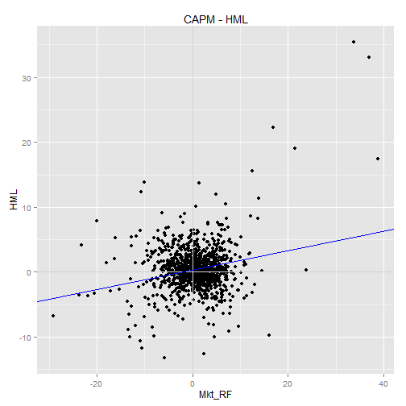

## Fin-Eval: Module 3.2 In-class Assignment

Rob Alderman  
Financial Evaluation and Strategy  
Module 3.2  
Sept 2015  

### Objective

Analyze the performance of value stocks (HML) from 1927 - 2014 in a CAPM framework. 


### Load data


```r
Sys.setenv(JAVA_HOME="C:\\fox\\java\\jre")
p <- Sys.getenv("PATH")
p1 <- paste("C:\\fox\\java\\jre\\bin\\j9vm;", p, sep="")
Sys.setenv(PATH=p1)

library(xlsx)

data <- read.xlsx("HML_1927_2014.xlsx", sheetIndex=1, rowIndex=4:1060,colIndex=1:4)
str(data)
```

```
## 'data.frame':	1056 obs. of  4 variables:
##  $ date  : num  192701 192702 192703 192704 192705 ...
##  $ Mkt_RF: num  -0.06 4.18 0.13 0.46 5.44 -2.34 7.26 1.97 4.76 -4.31 ...
##  $ SMB   : num  -0.56 -0.1 -1.6 0.39 1.41 0.48 -3.23 -0.72 -3.57 2.13 ...
##  $ HML   : num  4.83 3.17 -2.67 0.67 4.92 -1.53 -1.16 -3.69 -0.71 -4.33 ...
```

```r
head(data)
```

```
##     date Mkt_RF   SMB   HML
## 1 192701  -0.06 -0.56  4.83
## 2 192702   4.18 -0.10  3.17
## 3 192703   0.13 -1.60 -2.67
## 4 192704   0.46  0.39  0.67
## 5 192705   5.44  1.41  4.92
## 6 192706  -2.34  0.48 -1.53
```

```r
### Q1.  What's the average monthly return for HML?
```

```r
with(data, mean(HML))
```

```
## [1] 0.3974432
```


### Q2.  How much of HML return reflects performance beyond its benchmark (alpha)?


```r
model.hml <- lm(HML ~ Mkt_RF, data=data)
summary(model.hml)
```

```
## 
## Call:
## lm(formula = HML ~ Mkt_RF, data = data)
## 
## Residuals:
##      Min       1Q   Median       3Q      Max 
## -13.2768  -1.7209  -0.1681   1.4340  30.0954 
## 
## Coefficients:
##             Estimate Std. Error t value Pr(>|t|)    
## (Intercept)  0.30014    0.10697   2.806  0.00511 ** 
## Mkt_RF       0.14966    0.01961   7.630 5.24e-14 ***
## ---
## Signif. codes:  0 '***' 0.001 '**' 0.01 '*' 0.05 '.' 0.1 ' ' 1
## 
## Residual standard error: 3.451 on 1054 degrees of freedom
## Multiple R-squared:  0.05234,	Adjusted R-squared:  0.05144 
## F-statistic: 58.22 on 1 and 1054 DF,  p-value: 5.237e-14
```

```r
model.hml.alpha <- coef(model.hml)["(Intercept)"]
model.hml.beta <- coef(model.hml)["Mkt_RF"]

library(ggplot2)
qplot(y=HML, x=Mkt_RF, data=data) +
    ggtitle("CAPM - HML") + 
    geom_hline(y=0,colour="lightgray") +
    geom_vline(x=0,colour="lightgray") +
    geom_abline(intercept = model.hml.alpha, 
                slope = model.hml.beta, 
                colour="blue")
```

 

```r
# % of HML return that reflects outperformance of benchmark:
model.hml.alpha / mean(data$HML)
```

```
## (Intercept) 
##   0.7551671
```

### Q3.  How much of HML return reflects systemic risk (beta)?


```r
(mean(data$HML) - model.hml.alpha) / mean(data$HML)
```

```
## (Intercept) 
##   0.2448329
```


### Q4.  Does HML perform better in good times or bad?  Seems like good.


### Q5. What fraction of HML variability is explained by market-wide movements? (R<sup>2</sup>)


```r
summary(model.hml)$r.squared
```

```
## [1] 0.05234269
```


### 6. Have the publications of papers on SMB (in 1980) and HML (in 1992/93) affected the returns for those asset classes?


```r
data.1980.down <- subset(data, date < 198001)
data.1980.up <- subset(data, date >= 198001)

data.1992.down <- subset(data, date < 199201)
data.1992.up <- subset(data, date >= 199201)

mean(data$Mkt_RF)
```

```
## [1] 0.6501894
```

```r
mean(data.1980.down$Mkt_RF)
```

```
## [1] 0.6508648
```

```r
mean(data.1980.up$Mkt_RF)
```

```
## [1] 0.6491667
```

```r
mean(data.1992.down$Mkt_RF)
```

```
## [1] 0.6572692
```

```r
mean(data.1992.up$Mkt_RF)
```

```
## [1] 0.6301812
```

```r
mean(data$HML)
```

```
## [1] 0.3974432
```

```r
mean(data.1992.down$HML)
```

```
## [1] 0.4218077
```

```r
mean(data.1992.up$HML)  # after Fama's paper
```

```
## [1] 0.328587
```

```r
with(data, mean(SMB))
```

```
## [1] 0.2258617
```

```r
with(data.1980.down, mean(SMB))
```

```
## [1] 0.2890252
```

```r
with(data.1980.up, mean(SMB))
```

```
## [1] 0.1302143
```

```r
with(data.1992.up, mean(SMB))
```

```
## [1] 0.205471
```

```r
model.hml.1992 <- lm(HML ~ Mkt_RF, data=data.1992.up)
summary(model.hml.1992)
```

```
## 
## Call:
## lm(formula = HML ~ Mkt_RF, data = data.1992.up)
## 
## Residuals:
##      Min       1Q   Median       3Q      Max 
## -12.6241  -1.7751   0.0532   1.6408  11.7056 
## 
## Coefficients:
##             Estimate Std. Error t value Pr(>|t|)    
## (Intercept)  0.43750    0.18960   2.308 0.021772 *  
## Mkt_RF      -0.17282    0.04384  -3.942 0.000102 ***
## ---
## Signif. codes:  0 '***' 0.001 '**' 0.01 '*' 0.05 '.' 0.1 ' ' 1
## 
## Residual standard error: 3.116 on 274 degrees of freedom
## Multiple R-squared:  0.05368,	Adjusted R-squared:  0.05023 
## F-statistic: 15.54 on 1 and 274 DF,  p-value: 0.0001025
```

